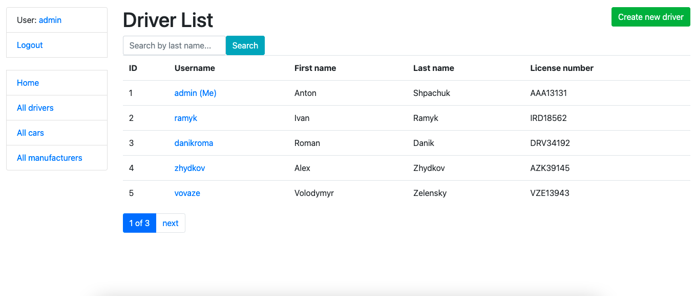

# Taxi Service

Django project for managing drivers, cars and manufacturers for Taxi Service

## Check it out!

[Taxi Service project on Heroku](https://taxi-app-service.herokuapp.com/)

## Installation

Python must be already installed

```shell
git clone https://github.com/anatomst/taxi-service.git
python3 -m venv venv
source venv/bin/activate (on Linux and macOS) or venv\Scripts\activate (on Windows)
pip install -r requirements.txt
python3 manage.py makemigrations
python3 manage.py migrate
python manage.py runserver
```

## Features

* Authentication functionality for Driver/User
* Managing drivers, cars and manufacturers using crud operations from website
* Powerful admin panel for advanced managing

## Full access:

* username: user123
* password: ASDZXCasdzxc123

## Demo


